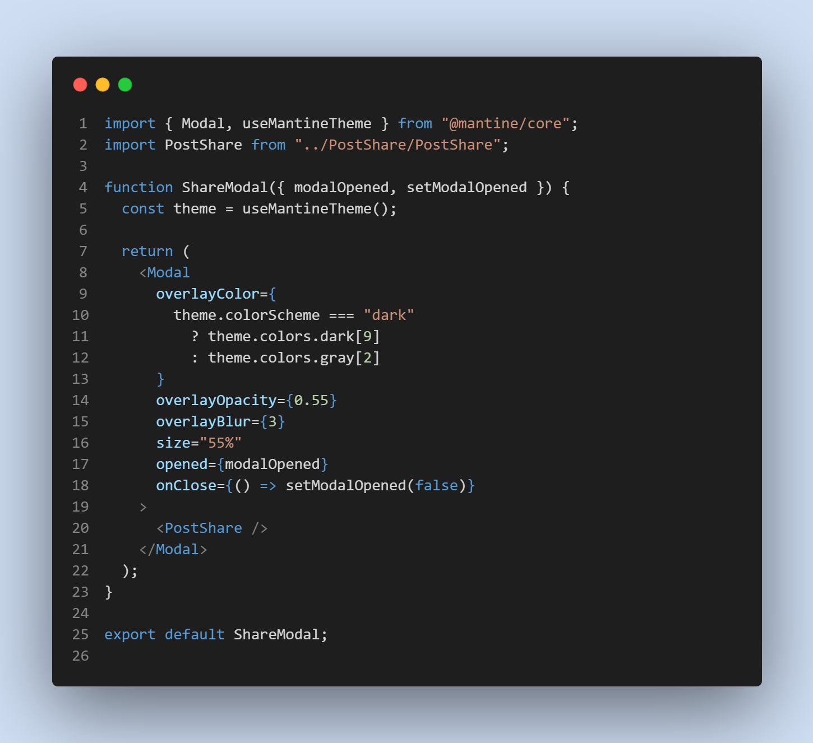
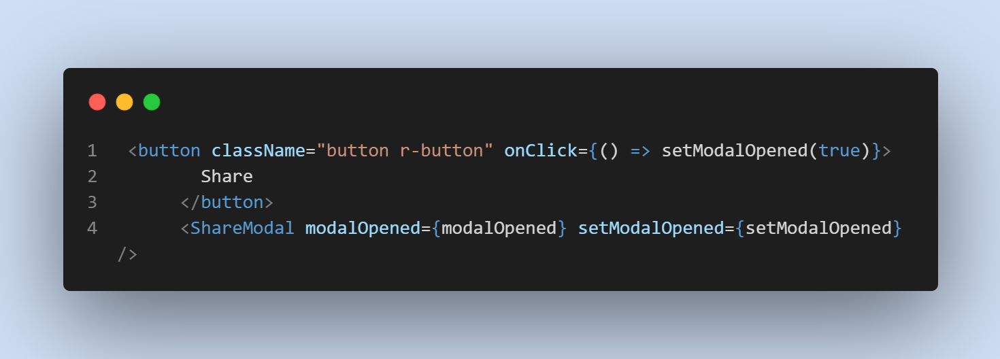

# Front End

### Technology

## [MantimeModel](https://mantime.dev)

- Modal Setup
  

- Modal Control
  

## Social Media 

 

 &nbsp;
 &nbsp;
&nbsp;
 

## Website 

 

<!--  -->
 

## PC Configuration 

 &nbsp;
 &nbsp;
 &nbsp;
 &nbsp;
 &nbsp;
 &nbsp;
 &nbsp;
 &nbsp;
 &nbsp;
 &nbsp;
 &nbsp;
 &nbsp;

## Laptop Configuration 

 &nbsp;
 &nbsp;
 &nbsp;
 &nbsp;
